# House of Things

### Introduction

A smart home is a residence that uses internet-connected devices to enable the remote monitoring and management of appliances and systems, such as lighting and heating.

### Goals

To develop a software system to monitor, control, and manage home automation devices and activities. The system should:

- Support multiple devices, including different sensors and actuators
  - Sensors collect data from the world
  - Actuators interact with the world, moving and controlling a mechanism or system
- Support easily adding new kinds of devices
- Support adding triggers and actions through the user interface
- Be possible to configure the system visually
- Support discoverability of new devices (i.e., plug and play)
- Be easy to integrate with well-known systems, such as SMS, Slack, WhatsApp, and other communication systems

### Prerequisites

- Java version 14 and Maven.
  - Make sure to set Java 14 SDK in IntelliJ. More information here if needed: https://crunchify.com/intellij-idea-how-to-set-latest-java-sdk-and-fix-an-error-errorjava-error-release-version-14-not-supported/

### Architecture

- This project is divided in two parts: 
    - Frontend implemented with Java FX. 
    - Backend implemented as REST APIs deployed as microservices.

## Backend

The backend part has four packages:
  - <b>launch</b>: Will add the necessary packages and will start Tomcat to listen to API calls.
  - <b>backend</b>: Receives REST APIs requests from the frontend and interacts with the device microservice.
  - <b>common</b>: Groups models and methods that are common to both backend and device services.
  - <b>device</b>: Holds the logic related to devices.


We chose the microservice architecture style because we wanted to run multiple instances of the device services at the same time we have a single instance 
of the backend service. In this context each device service represents a single instance of device. 
This project uses Java Rest API with Embedded Tomcat.

#### Building

The command below builds the project and must be executed after every change.

```bash
cd backend
mvn package
```

#### Running the backend microservice

This starts the backend listening to port 8080.

```bash
# On linux / mac:

SERVER_TYPE=backend ENDPOINT=http://localhost:8080  bash target/bin/webapp

# on windows

set SERVER_TYPE=backend 
set ENDPOINT=http://localhost:8080
cd target/bin/webapp
webapp.bat
```

#### Running the device microservices

This starts a temperature sensor listening to port 8081.

```bash
# On linux / mac:

SERVER_TYPE=device \
    ENDPOINT=http://localhost:8081 \
    DEVICE_NAME="Bedroom Temp Sensor" \
    DEVICE_TYPE=TEMPERATURE_SENSOR \
    BACKEND_ENDPOINT=http://localhost:8080 \
    bash target/bin/webapp

# on windows

set SERVER_TYPE=device 
set ENDPOINT=http://localhost:8081
set DEVICE_NAME="Bedroom Temp Sensor"
set DEVICE_TYPE=TEMPERATURE_SENSOR
set BACKEND_ENDPOINT=http://localhost:8080
cd target/bin/webapp
webapp.bat
```

This starts a ambient sensor listening to port 8085.

```bash
SERVER_TYPE=device \
    ENDPOINT=http://localhost:8085 \
    DEVICE_NAME="Bedroom Lumen Sensor" \
    DEVICE_TYPE=AMBIENT_SENSOR \
    BACKEND_ENDPOINT=http://localhost:8080 \
    bash target/bin/webapp
```

This starts an air conditioner listening to port 8082.

```bash
# On linux / mac:

SERVER_TYPE=device \
    ENDPOINT=http://localhost:8082 \
    DEVICE_NAME="Bedroom Air" \
    DEVICE_TYPE=AIR_CONDITIONER \
    BACKEND_ENDPOINT=http://localhost:8080 \
    MODE=COOL \
    TARGET=20 \
    bash target/bin/webapp

# on windows

set SERVER_TYPE=device 
set ENDPOINT=http://localhost:8082
set DEVICE_NAME="Bedroom Air"
set DEVICE_TYPE=AIR_CONDITIONER
set BACKEND_ENDPOINT=http://localhost:8080
set MODE=COOL
set TARGET=20
cd target/bin/webapp
webapp.bat
```

This starts a fireplace listening to port 8083.

```bash
# On linux / mac:

SERVER_TYPE=device \
    ENDPOINT=http://localhost:8083 \
    DEVICE_NAME="Living fireplace" \
    DEVICE_TYPE=FIREPLACE \
    BACKEND_ENDPOINT=http://localhost:8080 \
    TARGET=30 \
    bash target/bin/webapp

# on windows

set SERVER_TYPE=device 
set ENDPOINT=http://localhost:8083
set DEVICE_NAME="Living fireplace"
set DEVICE_TYPE=FIREPLACE
set BACKEND_ENDPOINT=http://localhost:8080
set TARGET=30
cd target/bin/webapp
webapp.bat
```

This starts a curtain listening to port 8086.

```bash
SERVER_TYPE=device \
    ENDPOINT=http://localhost:8086 \
    DEVICE_NAME="Bedroom curtain" \
    DEVICE_TYPE=CURTAIN \
    BACKEND_ENDPOINT=http://localhost:8080 \
    TARGET=80000 \
    bash target/bin/webapp
```


#### Backend microservice APIs

1. `GET /devices` - Lists the current devices.
2. `POST /devices` - Adds a new device.
3. `PUT /devices` - Edits a device.


#### Device microservice APIs

1. `GET /device` - Returns the details of the device
2. `POST /device/reading` - Sends an array of updated device readings to allow the device to react if necessary
3. `PUT /device` - Edits a device

## Frontend

To build and run the frontend: 

```
cd frontend
mvn clean install
mvn javafx:run
```

## The Patterns 

#### Problem in Context
In order to support the discoverability of new devices we decided to adopt a strategy using microservices in the backend. 
To be possible to new devices register themselves in the house's network automatically we had to split the backend service 
from the device service as they work as separate processes. 

We wanted to concentrate all frontend requests in the backend
and make the backend communicates with the device microservices via HTTP/REST requests so that the client won't need to handle
multiple calls to microservices endpoints.

#### The Pattern
The backend service acts like an API Gateway since is the single point of entry for the device microservices calls. It acts
as a reverse proxy, routing requests from clients to services.

#### Implementation
Frontend requests connect to a single endpoint, the backend service (acts like an API Gateway) that's configured to forward 
requests to device microservices.

##### UML
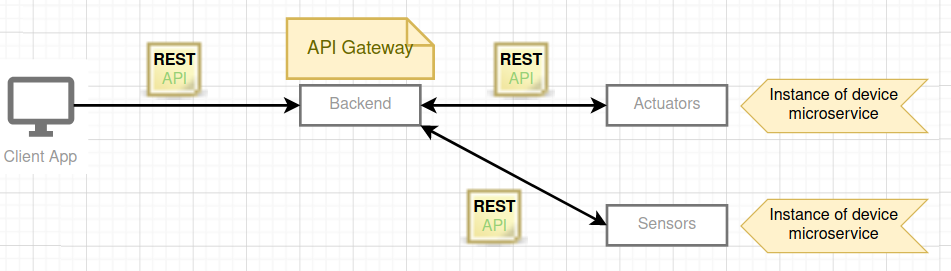

#### Implementation
###### Controller in the backend service
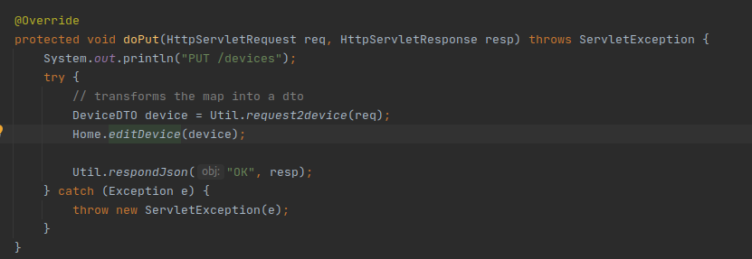
###### Service in backend service calls controller in device service
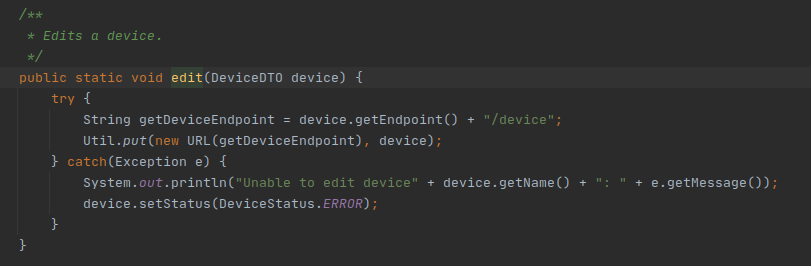
###### Controller in device service
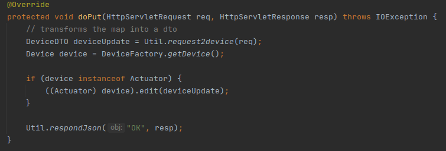

#### Consequences
- Insulates the client from the problem of determining the locations of service instances.
- Simplifies the client by moving logic for calling multiple services from the client to API Gateway.
- Increase in code complexity.

### Transfer Object Pattern
#### Problem in Context
In this application the backend microservice receives requests from the frontend and creates requests to each instance of the device 
microservice. The business logic is in the device microservice and is not needed in the backend service. 

Since the backend service only transfers the data to the device service we needed a way to create an object that could attend 
the frontend needs without replicating code or exposing the business logic in the backend service.

#### The Pattern
The data transfer object pattern is a POJO class having only getter/setter methods and is serializable so that it can be transferred
over the network. It's basically used to carry data between processes.

#### Implementation

##### UML


###### DeviceDTO


###### Home

###### Devices Controller


#### Consequences
- Reduces code duplication since the behavior behind these objects is only in device microservice and is not duplicated in backend microservice.
- Simplifies remote object and remote interface so the frontend calls can only deal with simplified objects.

### Model-View-Controller (MVC)

#### Problem in Context 
In this application MVC design pattern helped a lot because it's a easy way to communicate with the view, it separates the representation of information from the logic used to obtain and manipulate the content.

#### The Pattern
MVC patterns separate the input, processing, and output of an application. This model divided into three interconnected called model, the view, and the controller. 
All of the three above given components are built to handle some specific development aspects of any web or.net application development.

#### Implementation

###### Device.java
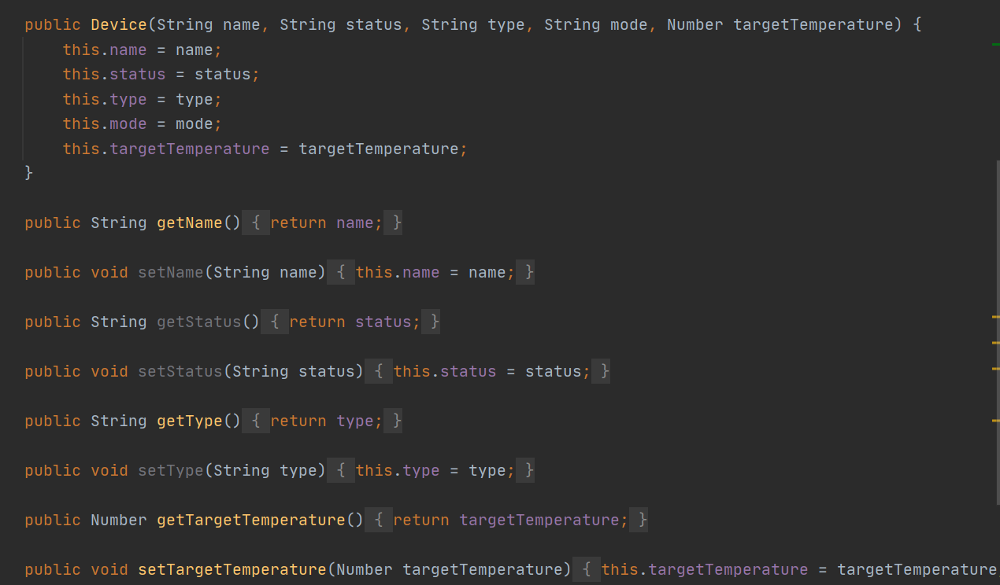

###### DeviceStatusView
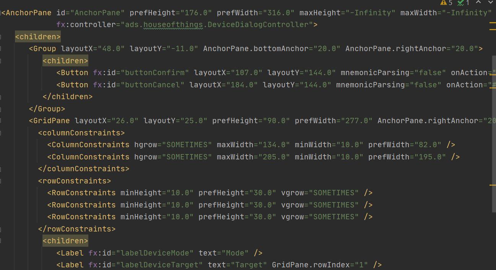

###### DeviceController
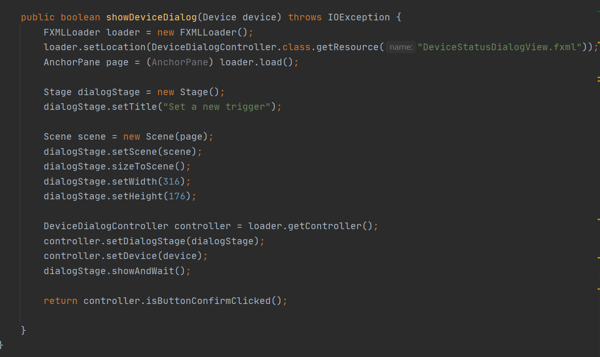

#### Consequences 

- Faster development process.
- Ability to provide multiple views.
- The modification does not affect the entire model.


### Template Method
#### Problem in Context
On House of Things the devices receive updates from the sensors. As there are several sensors types, we need an abstract class that can be adapted to read from different kind of sensors.

#### The Pattern 
Template Method is a behavioural design pattern that defines the skeleton of an algorithm in the superclass but lets subclasses override specific steps of the algorithm without changing its structure.

#### Implementation

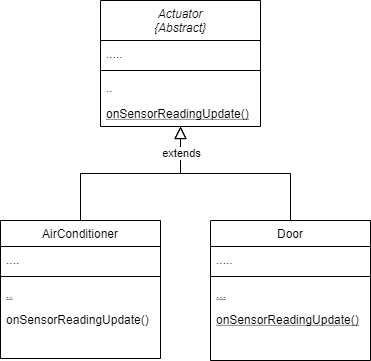

###### Actuator.Java
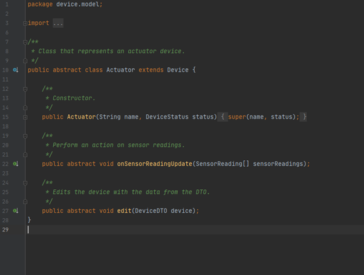

###### AirConditioner.Java
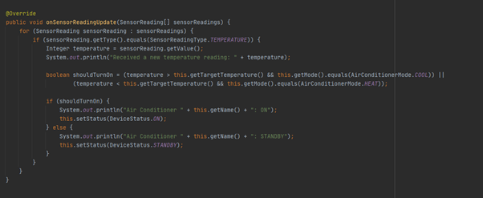

###### Door.Java
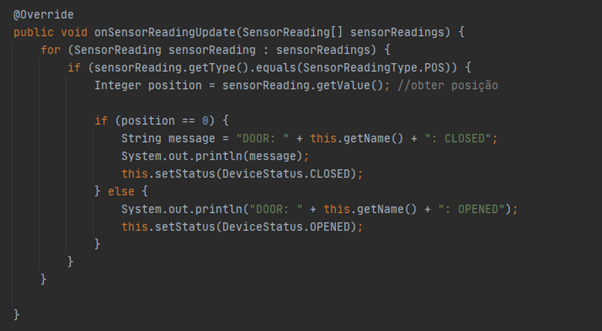

#### Consequences 
The Actuator.class is an abstract class containing the skeleton. The algorithm to update a sensor reading is defined in the Actuator.class. But the subclasses (AirConditioner.class and Door.class) have different individual operations, the way the individual’s operations are performed vary on the subclasses.

The template method is used for the following reasons:
- Let subclasses implement varying behaviour (through “@Override”)
- Avoid duplication in the code, the skeleton is implemented once in the abstract class’s algorithm, and variations are defined in the subclasses.
- Control at what points subclassing is allowed. As opposed to a simple polymorphic override, where the base method would be entirely rewritten allowing radical change to the workflow, only the specific details of the workflow are allowed to change.

### Bridge

#### Problem in Context
We choose to use split the application in frontend and backend thinking that user interface could be a client application, a web browser or a mobile application so our model at presentation layer needs to communicate with our services in a loused couple way.

#### The Pattern
We decided to use tomcat webserver delivering REST calls as abstraction between front and backend, with this our frontend don't need to know all methods and classes of our application to call the services.

Each new devices is an implementation of device class and runs as a webserver on backend server. The backend main application controls what device frontend is calling.

#### Implementation

###### Frontend

###### Backend


#### Consequences

- The frontend layer don't need to know how to call each device on the system
- Any changes on devices classes could be applied without to modified frontend layer since backend payload doesn't change.
- Frontend has total abstraction about backend logic.

### Team Members
| Nome | Contato |
| ------ | ------ |
|Diana Mourão | up202002016@fe.up.pt |
|João Fernandes | up202003038@fe.up.pt |
|Kadu Barral | up202000017@fe.up.pt |
|Priscilla Melin | up201900048@fe.up.pt |
