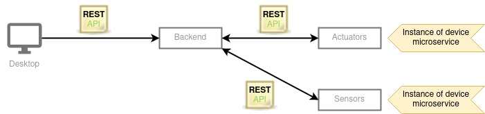

# House of Things

### Introduction

A smart home is a residence that uses internet-connected devices to enable the remote monitoring and management of appliances and systems, such as lighting and heating.

### Goals

To develop a software system to monitor, control, and manage home automation devices and activities. The system should:

- Support multiple devices, including different sensors and actuators
  - Sensors collect data from the world
  - Actuators interact with the world, moving and controlling a mechanism or system
- Support easily adding new kinds of devices
- Support adding triggers and actions through the user interface
- Be possible to configure the system visually
- Support discoverability of new devices (i.e., plug and play)
- Be easy to integrate with well-known systems, such as SMS, Slack, WhatsApp, and other communication systems

### Prerequisites

- Java version 14 and Maven.
  - Make sure to set Java 14 SDK in IntelliJ. More information here if needed: https://crunchify.com/intellij-idea-how-to-set-latest-java-sdk-and-fix-an-error-errorjava-error-release-version-14-not-supported/

### Architecture

- This project is divided into three parts: 
    - Frontend implemented with Java FX. 
    - Backend built as a microservice with a single instance. It's a Java Rest API using Embedded Tomcat.
    - Device microservice considering that each instance of a device is a microservice.
    


- The backend part has four packages:
  - <b>launch</b>: Will add the necessary packages and will start Tomcat to listen to API calls.
  - <b>backend</b>: Receives REST APIs requests from the frontend and interacts with the device microservice.
  - <b>common</b>: Groups models and methods that are common to both backend and device services.
  - <b>device</b>: Holds the logic related to devices.


### Class Diagram


### Building

The command below builds the project and must be executed after every change.

```bash
mvn package
```

#### Backend microservice

This starts the backend listening to port 8080.

```bash
# On linux / mac:

SERVER_TYPE=backend ENDPOINT=http://localhost:8080  bash target/bin/webapp

# on windows

set SERVER_TYPE=backend 
set ENDPOINT=http://localhost:8080
cd target/bin/webapp
webapp.bat
```

#### Device microservice

This starts a temperature sensor listening to port 8081.

```bash
# On linux / mac:

SERVER_TYPE=device \
    ENDPOINT=http://localhost:8081 \
    DEVICE_NAME=tempSensor1 \
    DEVICE_TYPE=TEMPERATURE_SENSOR \
    BACKEND_ENDPOINT=http://localhost:8080 \
    bash target/bin/webapp

# on windows

set SERVER_TYPE=device 
set ENDPOINT=http://localhost:8081
set DEVICE_NAME=tempSensor1
set DEVICE_TYPE=TEMPERATURE_SENSOR
set BACKEND_ENDPOINT=http://localhost:8080
cd target/bin/webapp
webapp.bat
```

This starts an air conditioner listening to port 8082.

```bash
# On linux / mac:

SERVER_TYPE=device \
    ENDPOINT=http://localhost:8082 \
    DEVICE_NAME=aircon1 \
    DEVICE_TYPE=AIR_CONDITIONER \
    BACKEND_ENDPOINT=http://localhost:8080 \
    MODE=COOL \
    TARGET_TEMPERATURE=20 \
    bash target/bin/webapp

# on windows

set SERVER_TYPE=device 
set ENDPOINT=http://localhost:8082
set DEVICE_NAME=aircon1
set DEVICE_TYPE=AIR_CONDITIONER
set BACKEND_ENDPOINT=http://localhost:8080
set MODE=COOL
set TARGET_TEMPERATURE=20
cd target/bin/webapp
webapp.bat
```

### API Documentation

#### Backend microservice APIs

1. `GET /devices` - Lists the current devices.
2. `POST /devices` - Adds a new device.
3. `PUT /devices` - Edits a device.


#### Device microservice APIs

1. `GET /device` - Returns the details of the device
2. `POST /device/reading` - Sends an array of updated device readings to allow the device to react if necessary
3. `PUT /device` - Edits a device

### Patterns Used

* [Singleton](./docs/patterns/Singleton.md)
* [Factory Method](./docs/patterns/FactoryMethod.md)
* [Transfer Object](./docs/patterns/TransferObject.md)
* [Microservice](./docs/patterns/Microservice.md)

### Team Members
| Nome | Contato |
| ------ | ------ |
|Diana Mourão | up202002016@fe.up.pt |
|João Fernandes | up202003038@fe.up.pt |
|Kadu Barral | up202000017@fe.up.pt |
|Priscilla Melin | up201900048@fe.up.pt |
