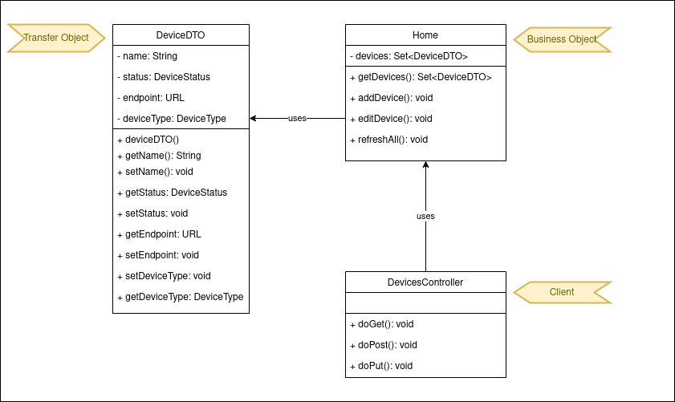
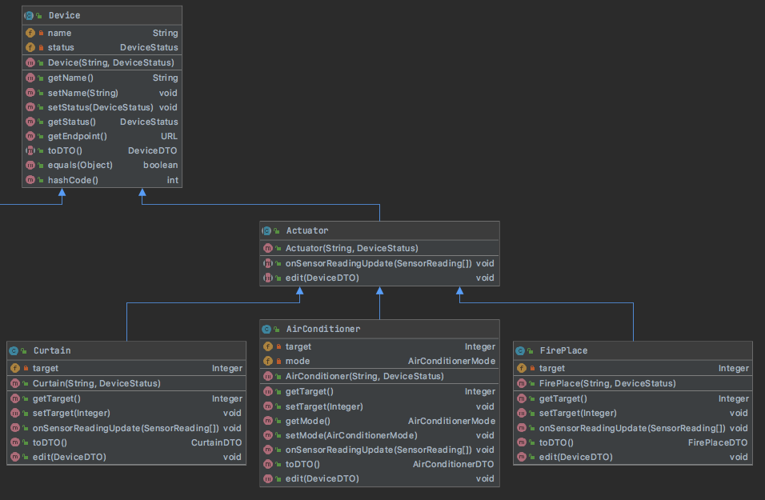

# House of Things

### Introduction

A smart home is a residence that uses internet-connected devices to enable the remote monitoring and management of appliances and systems, such as lighting and heating.

### Goals

To develop a software system to monitor, control, and manage home automation devices and activities. The system has the following requirements:

- Support multiple devices, including different sensors and actuators
  - Sensors collect data from the world
  - Actuators interact with the world, moving and controlling a mechanism or system
- Support easily adding new kinds of devices
- Support adding triggers and actions through the user interface
- Be possible to configure the system visually
- Support discoverability of new devices (i.e., plug and play)

### Prerequisites

- Java version 14 and Maven.
  - Make sure to set Java 14 SDK in IntelliJ. More information here if needed: https://crunchify.com/intellij-idea-how-to-set-latest-java-sdk-and-fix-an-error-errorjava-error-release-version-14-not-supported/

### Architecture

- This project is divided in two parts: 
    - Frontend implemented with Java FX. 
    - Backend implemented as REST APIs deployed as microservices.

## Backend

The backend part has four packages:
  - <b>launch</b>: Will add the necessary packages and will start Tomcat to listen to API calls.
  - <b>backend</b>: Receives REST APIs requests from the frontend and interacts with the device microservice.
  - <b>common</b>: Groups models and methods that are common to both backend and device services.
  - <b>device</b>: Holds the logic related to devices.


We chose the microservice architecture style because we wanted to run multiple instances of the device services at the same time we have a single instance 
of the backend service. In this context each device service represents a single instance of device. 
This project uses Java Rest API with Embedded Tomcat.

#### Building

The command below builds the project and must be executed after every change.

```bash
cd backend
mvn package
```

#### Running the backend microservice

This starts the backend listening to port 8080.

```bash
# On linux / mac:

SERVER_TYPE=backend ENDPOINT=http://localhost:8080  bash target/bin/webapp

# on windows

set SERVER_TYPE=backend 
set ENDPOINT=http://localhost:8080
cd target/bin/webapp
webapp.bat
```

#### Running the device microservices

This starts a temperature sensor listening to port 8081.

```bash
# On linux / mac:

SERVER_TYPE=device \
    ENDPOINT=http://localhost:8081 \
    DEVICE_NAME="Bedroom Temp Sensor" \
    DEVICE_TYPE=TEMPERATURE_SENSOR \
    BACKEND_ENDPOINT=http://localhost:8080 \
    bash target/bin/webapp

# on windows

set SERVER_TYPE=device 
set ENDPOINT=http://localhost:8081
set DEVICE_NAME="Bedroom Temp Sensor"
set DEVICE_TYPE=TEMPERATURE_SENSOR
set BACKEND_ENDPOINT=http://localhost:8080
cd target/bin/webapp
webapp.bat
```

This starts a ambient sensor listening to port 8085.

```bash
# On linux / mac:

SERVER_TYPE=device \
    ENDPOINT=http://localhost:8085 \
    DEVICE_NAME="Bedroom Lux Sensor" \
    DEVICE_TYPE=AMBIENT_SENSOR \
    BACKEND_ENDPOINT=http://localhost:8080 \
    bash target/bin/webapp
```

This starts an air conditioner listening to port 8082.

```bash
# On linux / mac:

SERVER_TYPE=device \
    ENDPOINT=http://localhost:8082 \
    DEVICE_NAME="Bedroom Air" \
    DEVICE_TYPE=AIR_CONDITIONER \
    BACKEND_ENDPOINT=http://localhost:8080 \
    MODE=COOL \
    TARGET=20 \
    bash target/bin/webapp

# on windows

set SERVER_TYPE=device 
set ENDPOINT=http://localhost:8082
set DEVICE_NAME="Bedroom Air"
set DEVICE_TYPE=AIR_CONDITIONER
set BACKEND_ENDPOINT=http://localhost:8080
set MODE=COOL
set TARGET=20
cd target/bin/webapp
webapp.bat
```

This starts a fireplace listening to port 8083.

```bash
# On linux / mac:

SERVER_TYPE=device \
    ENDPOINT=http://localhost:8083 \
    DEVICE_NAME="Living fireplace" \
    DEVICE_TYPE=FIREPLACE \
    BACKEND_ENDPOINT=http://localhost:8080 \
    TARGET=30 \
    bash target/bin/webapp

# on windows

set SERVER_TYPE=device 
set ENDPOINT=http://localhost:8083
set DEVICE_NAME="Living fireplace"
set DEVICE_TYPE=FIREPLACE
set BACKEND_ENDPOINT=http://localhost:8080
set TARGET=30
cd target/bin/webapp
webapp.bat
```

This starts a curtain listening to port 8086.

```bash
# On linux / mac:

SERVER_TYPE=device \
    ENDPOINT=http://localhost:8086 \
    DEVICE_NAME="Bedroom curtain" \
    DEVICE_TYPE=CURTAIN \
    BACKEND_ENDPOINT=http://localhost:8080 \
    TARGET=80000 \
    bash target/bin/webapp
```


#### Backend microservice APIs

1. `GET /devices` - Lists the current devices.
2. `POST /devices` - Adds a new device.
3. `PUT /devices` - Edits a device.


#### Device microservice APIs

1. `GET /device` - Returns the details of the device
2. `POST /device/reading` - Sends an array of updated device readings to allow the device to react if necessary
3. `PUT /device` - Edits a device

## Frontend

To build and run the frontend: 

```
cd frontend
mvn clean install
mvn javafx:run
```

## The Patterns 

### Data Transfer Object Pattern
#### Problem in Context
In this application the backend microservice receives requests from the frontend and creates requests to each instance of the device 
microservice. The business logic is in the device microservice and is not needed in the backend service. 

Since the backend service only transfers the data to the device service we needed a way to create an object that could attend 
the frontend needs without replicating code or exposing the business logic in the backend service.

#### The Pattern
This pattern was selected because it provides simpler model objects that don't have business logic. Modeling DTO objects with only a set of attributes, 
constructors and getter/setter methods allowed us to not expose or repete the business logic contained in the model classes from the device service in the backend service and also simplified remote calls from the frontend. 

#### Implementation

##### UML
The frontend requests an updated list of all devices in a smart house. The GET /devices route placed in the DevicesController class calls a method from
Home class in order to obtain updated data from all sensors and actuators. The Home class has a set of DeviceDTO objects and these objects will be transfered through the network  as a response to these frontend requests.



###### [DeviceDTO](./backend/src/main/java/common/model/dto/DeviceDTO.java)

###### [Home](./backend/src/main/java/backend/model/Home.java)
###### [DevicesController](./backend/src/main/java/backend/controller/DevicesController.java)

#### Consequences
- Reduces code duplication since the behavior behind these objects is only in device microservice and is not duplicated in backend microservice.
- Simplifies the remote object and the remote interface so the frontend calls can only deal with simplified objects.

### Model-View-Controller (MVC)

#### Problem in Context 
In this application the MVC design pattern was used to segregate the views from the model and controllers, with this it can offer support for rapid and parallel development on design and functionality. It helps separating the display and the data and allow modification in each data without affecting the others. It is also an easy way to communicate with the view, it can comprise better and more interactive experiences to meet user expectations. 

#### The Pattern
The model is responsible for managing the data of the application. It receives user input from the controller. The view means the presentation of the model in a particular format and the controller responds to the user input and performs interactions on the data model objects. 
In terms of development becomes more smoother comparing to the traditional approach due to its advantages of code reuse and simultaneous application development.

#### Implementation

###### Device.java
[Model](./frontend/src/main/java/ads/houseofthings/model/domain/Device.java)

###### DeviceStatusView
[View](./frontend/target/classes/ads/houseofthings/DeviceStatusView.fxml)

###### DeviceController
[Controller](./frontend/src/main/java/ads/houseofthings/DeviceController.java)

#### Consequences 
- Faster development process.
- Ability to provide multiple views.
- The modification does not affect the entire model.


### Template Method
#### Problem in Context
In this application all the devices receive updates from sensors.

As there can be many types of devices it is only logical that these devices can have their own method implementation to adapt to the sensor reading they receive. 
That is why the Template Pattern is used in HoT. The Actuator abstract class defines the operations ( methods) with a template method set to be final, "Define the skeleton of an algorithm in an operation, deferring some steps to subclasses. Template Method lets subclasses redefine certain steps of an algorithm without changing the algorithm's structure." (as given in GOF book, by Eric Gamma).

Air Conditioner, Curtain and Fireplace are concrete classes that extend the Actuator class and override its methods, to suit their needs (adapt to the type of reading they receive and adapt the usage of that data).

#### The Pattern 
Template Method is a behavioural design pattern that defines the skeleton of an algorithm in the superclass, usually a abstract superclass, but lets subclasses override specific steps of the algorithm without changing its structure.

#### Implementation
Air Conditioner, Curtain and Fireplace will all apply a different implementation of the method "onSensorReadingUpdate" definied abstractly on the Actuator, and here is where the template method is applied.
##### UML Diagram



###### [Actuator](./backend/src/main/java/device/model/Actuator.java)

###### [AirCon](./backend/src/main/java/device/model/airconditioner/AirConditioner.java)

###### [Curtain](./backend/src/main/java/device/model/curtain/Curtain.java)

###### [Fireplace](./backend/src/main/java/device/model/fireplace/FirePlace.java)

#### Consequences 
The Actuator.java is an abstract class containing the skeleton. The algorithm to update a sensor reading is abstractly defined in the Actuator.class. But the subclasses (AirConditioner.java, Fireplace.java and Curtain.java) have different individual operations, the way the individual operations are performed vary on the subclasses.

The template method is used for the following reasons:
- Let subclasses implement varying behaviour (through “@Override”)
- Avoid duplication in the code, the skeleton is implemented once in the abstract class’s algorithm, and variations are defined in the subclasses.
- Control at what points subclassing is allowed. As opposed to a simple polymorphic override, where the base method would be entirely rewritten allowing radical change to the workflow, only the specific details of the workflow are allowed to change.

### Bridge

#### Problem in Context
We choose to use split the application in frontend and backend thinking that user interface could be a client application, a web browser or a mobile application so our model at presentation layer needs to communicate with our services in a loused couple way.

#### The Pattern
We decided to use tomcat webserver delivering REST calls as abstraction between front and backend, with this our frontend don't need to know all methods and classes of our application to call the services.

Each new devices is an implementation of device class and runs as a webserver on backend server. The backend main application controls what device frontend is calling.

#### Implementation

###### Frontend
[Frontend abstraction](https://github.com/jfgcf/ads_houseofthings/blob/4a294b522f64f9a2c9c682c7bb7b63dd0565e105/frontend/src/main/java/ads/houseofthings/DeviceController.java#L60)
###### Backend
[Backend business logic](https://github.com/jfgcf/ads_houseofthings/blob/4a294b522f64f9a2c9c682c7bb7b63dd0565e105/backend/src/main/java/device/controller/DeviceController.java#L26)

#### Consequences

- The frontend layer don't need to know how to call each device on the system
- Any changes on devices classes could be applied without to modified frontend layer since backend payload doesn't change.
- Frontend has total abstraction about backend logic.


### Data access object Pattern

#### Problem in Context
Frontend UI have to retrieve information from backend, but the fields on presentation layer can't call the backend service for each object. 

#### The Pattern
This pattern was selected because it provides simple access to data without have to implement a lot of connections to backend. Configuring DAO objects with necessary connections we use a single responsibility principle avoiding other classes to do this job.

#### Implementation
#### UML


[DeviceDAO](https://github.com/jfgcf/ads_houseofthings/blob/main/frontend/src/main/java/ads/houseofthings/model/dao/DeviceDAO.java)

[Device](https://github.com/jfgcf/ads_houseofthings/blob/main/frontend/src/main/java/ads/houseofthings/model/domain/Device.java)

#### Consequences
- Reduces code duplication
- It separates the domain logic that use it from any particular persistence mechanism or APIs.
- Loose coupling between layers.

### Team Members
| Nome | Contato |
| ------ | ------ |
|Diana Mourão | up202002016@fe.up.pt |
|João Fernandes | up202003038@fe.up.pt |
|Kadu Barral | up202000017@fe.up.pt |
|Priscilla Melin | up201900048@fe.up.pt |
