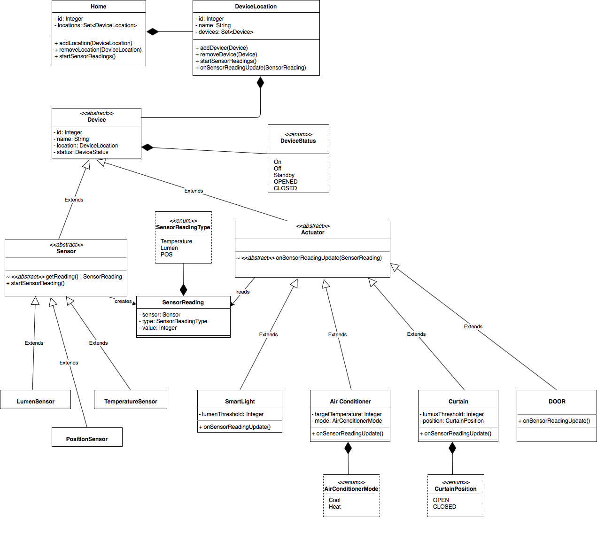

# House of Things

### Introduction

A smart home is a residence that uses internet-connected devices to enable the remote monitoring and management of appliances and systems, such as lighting and heating.

### Goals

To develop a software system to monitor, control, and manage home automation devices and activities. The system should:

- Support multiple devices, including different sensors and actuators
  - Sensors collect data from the world
  - Actuators interact with the world, moving and controlling a mechanism or system
- Support easily adding new kinds of devices
- Support adding triggers and actions through the user interface
- Be possible to configure the system visually
- Support discoverability of new devices (i.e., plug and play)
- Be easy to integrate with well-known systems, such as SMS, Slack, WhatsApp, and other communication systems

### Class Diagram

### Patterns Used

* [Observer Method](docs/patterns/Observer.md)

### Team Members
| Nome | Contato |
| ------ | ------ |
|Diana Mourão | up202002016@fe.up.pt |
|João Fernandes | up202003038@fe.up.pt |
|Kadu Barral | up202000017@fe.up.pt |
|Priscilla Melin | up201900048@fe.up.pt |