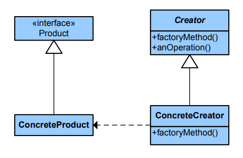

# Factory Method

**Factory Method** is a creational design pattern that provides an interface for creating objects in a superclass, but allows subclasses to alter the type of objects that will be created.

## Problem

#####Support easily adding new kinds of devices

If we decided to start to code just thinking in one kind of device, our code would be coupled to this device class, adding other kinds of devices would require making changes to the entire codebase. 

## Solution

The Factory Method pattern suggests that we replace direct object construction calls (using the new operator) with calls to a special factory method.
Objects returned by a factory method are often referred to as *products*.

## Structure

