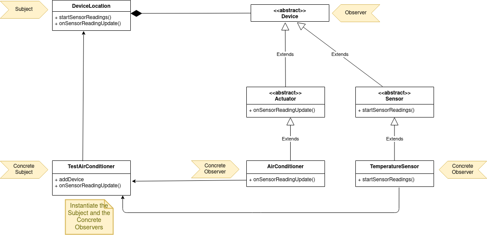

# Observer Method

**Observer Method** is a behavioral design pattern that provides ways of notifying objects about events that happen to the object they’re observing.

## Problems

- Support discoverability of new devices
- Support triggers and actions

We use the Observer Pattern so that we have a way of checking and updating all devices connected in the same house.  

## Solution

The DeviceLocation class acts like the subject. It has a set of devices which act as Observers. The subject has two important methods: <i>startSensorReadings</i> which notifies all the sensors
to update their readings and <i>onSensorReadingUpdate</i> which receives reading updates from the sensors and notifies 
the actuators that may take actions based on it. In this architecture the ConcreteObserver are the
different concrete classes that extend the Device abstract class.

## Structure

