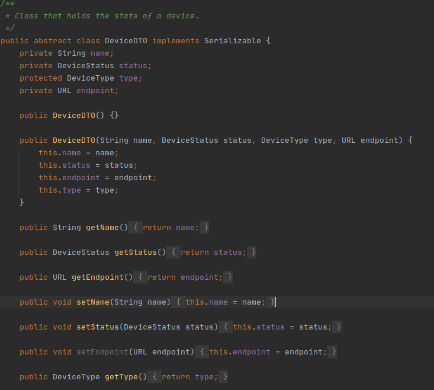
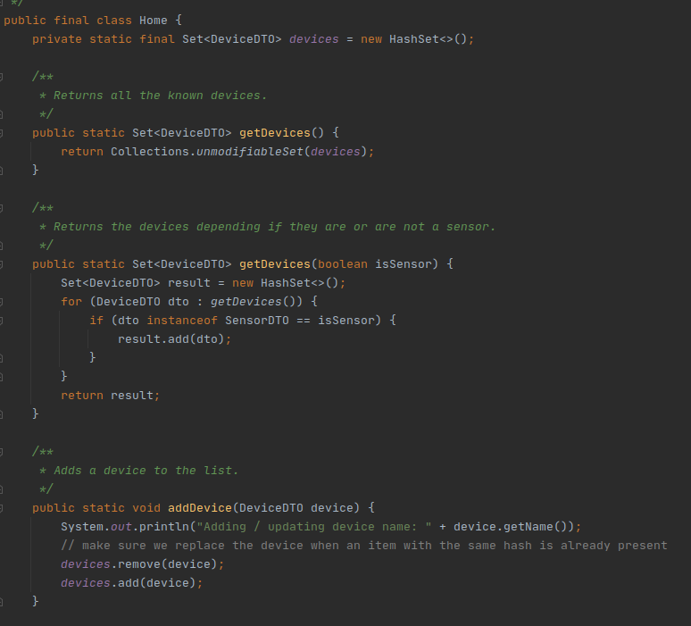
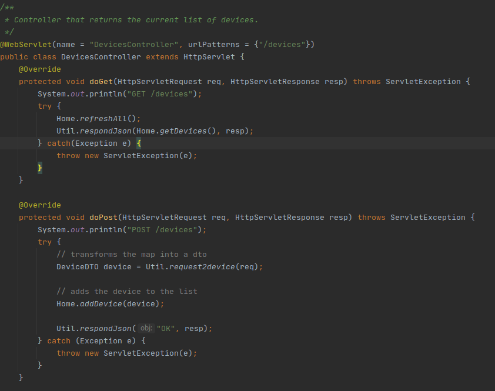

# Transfer Object Pattern

## Problem in Context
In this application the backend microservice receives requests from the frontend and creates requests to each instance of the device 
microservice. The business logic is in the device microservice and is not needed in the backend service. 

Since the backend service only transfers the data to the device service we needed a way to create an object that could attend 
the frontend needs without replicating code or exposing the business logic in the backend service.

## The Pattern
The data transfer object pattern is a POJO class having only getter/setter methods and is serializable so that it can be transferred
over the network. It's basically used to carry data between processes.
 
## Implementation

#### UML

#### DeviceDTO

####Home

####Devices Controller

## Consequences
- Reduces code duplication since the behavior behind these objects is only in device microservice and is not duplicated in backend microservice.
- Simplifies remote object and remote interface so the frontend calls can only deal with simplified objects.